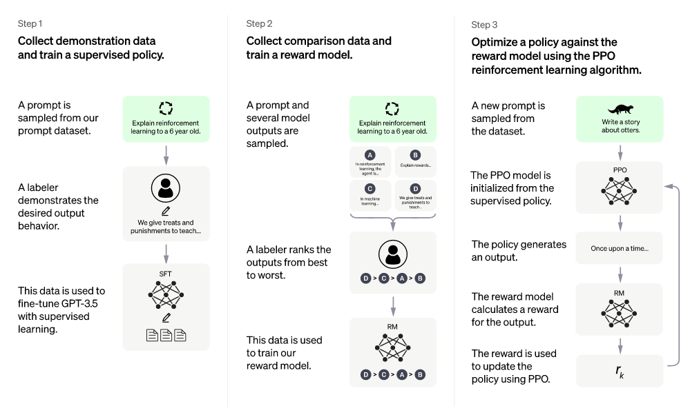
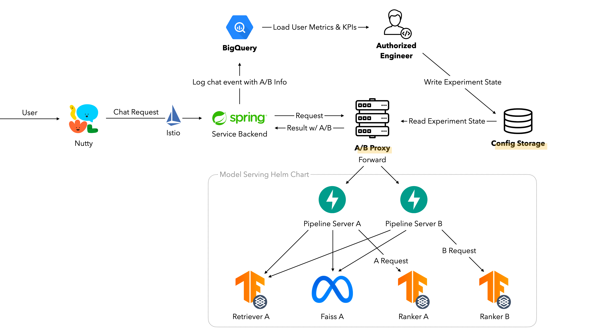
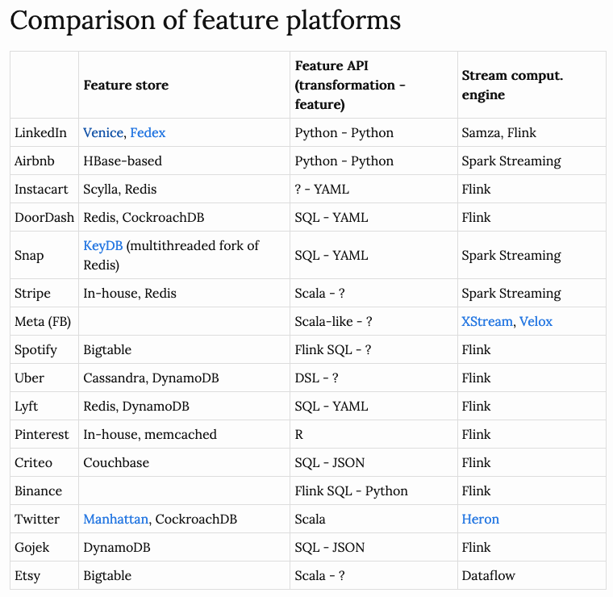

# Summary of Important AI & ML Blog Posts
* NOTE: 본 내용은 다음의 기준으로 선별된 것입니다.
  * 양질의 콘텐츠를 올리는 기업, 연구 기관, 개인의 블로그를 후보로 하며 중요도와 인기도를 바탕으로 포스팅을 선별합니다.
  * 순수 연구보다는 비즈니스 적용 사례를 더 중요하게 여깁니다. 공개된 소스코드, 모델 체크포인트 등이 있을 경우 중요도는 올라갑니다.
  * AWS ML 관련 내용이 중점적으로 따로 다뤄집니다.
  * 주로 다루는 기술 범위는 CV, NLP, 추천 시스템, 모델 훈련과 추론, MLOps입니다. 

## 1. Research
### 1.1. CV
* [Autoencoders and Diffusers: A Brief Comparison (Dec 2022)](https://eugeneyan.com//writing/autoencoders-vs-diffusers/)
* [*Data2vec 2.0*: Highly Efficient Self-Supervised Learning for Vision, Speech and Text (Dec 2022, Meta)](https://ai.facebook.com/blog/ai-self-supervised-learning-data2vec/)
* [Text-to-Image: Diffusion, Text Conditioning, Guidance, Latent Space (Nov 2022)](https://eugeneyan.com//writing/text-to-image/)

### 1.2. NLP
* [*Atlas*: Few-Shot Learning with Retrieval Augmented LMs (Jan 2023, Meta)](https://research.facebook.com/blog/2023/1/atlas-few-shot-learning-with-retrieval-augmented-language-models/)
* [Some Remarks on LLMs (Jan 2023)](https://gist.github.com/yoavg/59d174608e92e845c8994ac2e234c8a9)
    * 현재 사람 수준에서 섀넌의 추측 게임을 수행 가능할 정도로 LLM은 지능을 가지고 있음, 그러나 대규모 언어 모델링만으로 얻을 수 있는 것이 아님
    * 기존 언어 모델은 텍스트 기호만 학습했을 뿐 기호에 의미가 연결되어 있지 않음 ← ① 프로그래밍 언어 코드 데이터 훈련 ② 명시적인 지시를 통한 튜닝 ③ RLHF 단계의 도입으로 변곡점 발생(= 기호와 의미의 연결이 가능) 
    * 언어 모델 한계에 대한 진부한 주장들과 그와 별개로 아직 실제로 제대로 하지 못하는 것들
* [Accelerating Text Generation with Confident Adaptive Language Modeling (*CALM*) (Dec 2022, Google)](https://ai.googleblog.com/2022/12/accelerating-text-generation-with.html?m=1)
* [Illustrating Reinforcement Learning from Human Feedback (RLHF) (Dec 2022, HuggingFace)](https://huggingface.co/blog/rlhf)
    * ① 정책 언어 모델과 ② 프롬프트 별 생성 텍스트에 대해 사람의 선호도 점수로 학습한 보상 모델 이용하여 언어 모델 튜닝(= PPO)
* [Better LMs without Massive Compute (Nov 2022, Google)](https://ai.googleblog.com/2022/11/better-language-models-without-massive.html)
* [*ChatGPT*: Optimizing LMs for Dialogue (Nov 2022, OpenAI)](https://openai.com/blog/chatgpt/)
    * GPT 3.5, 사람 피드백 기반의 강화 학습(RLHF)으로 파인 튜닝 → 편향과 유해성 제거

* [Choosing the Right LM For Your NLP Use Case (Nov 2022)](https://www.topbots.com/choosing-the-right-language-model/)
* [MoE with Expert Choice Routing (Nov 2022, Google)](https://ai.googleblog.com/2022/11/mixture-of-experts-with-expert-choice.html)
* [Robots That Write Their Own Code (Nov 2022, Google)](https://ai.googleblog.com/2022/11/robots-that-write-their-own-code.html)
* [The State of Multilingual AI (Nov 2002)](http://ruder.io/state-of-multilingual-ai/)
* [Aligning Language Models to Follow Instructions (Jan 2022, OpenAI)](https://openai.com/blog/instruction-following/)

### 1.3. RecSys, etc.
* [Mastering Stratego, the Classic Game of Imperfect Information (Dec 2022, DeepMind)](https://www.deepmind.com/blog/mastering-stratego-the-classic-game-of-imperfect-information)
* [Research @ MS 2022: A Look Back at a Year of Accelerating Progress in AI (Dec 2022, Microsoft)](https://www.microsoft.com/en-us/research/blog/2022-a-look-back-at-a-year-of-accelerating-progress-in-ai/)
    * 이미지 모델 [Swin Transformer v2](https://www.microsoft.com/en-us/research/blog/swin-transformer-supports-3-billion-parameter-vision-models-that-can-train-with-higher-resolution-images-for-greater-task-applicability), 챗봇을 위한 언어 모델 [GODEL](https://www.microsoft.com/en-us/research/blog/godel-combining-goal-oriented-dialog-with-real-world-conversations/), 멀티모달 [BEiT](https://github.com/microsoft/unilm/tree/master/beit), 언어 모델 디버깅 도구 [AdaTest](https://www.microsoft.com/en-us/research/blog/partnering-people-with-large-language-models-to-find-and-fix-bugs-in-nlp-systems/), 유해 콘텐츠 데이터 생성 도구 [ToxiGen](https://www.microsoft.com/en-us/research/blog/detoxigen-leveraging-large-language-models-to-build-more-robust-hate-speech-detection-tools/), NN HPO기법 [µTransfer](https://www.microsoft.com/en-us/research/blog/%c2%b5transfer-a-technique-for-hyperparameter-tuning-of-enormous-neural-networks/), 모델 압축과 양자화를 위한 [DeepSpeed Compression](https://www.microsoft.com/en-us/research/blog/deepspeed-compression-a-composable-library-for-extreme-compression-and-zero-cost-quantization/) 등
* [Evolutionary-Scale Prediction of Atomic Level Protein Structure with a LM (Nov 2022, Meta)](https://ai.facebook.com/blog/protein-folding-esmfold-metagenomics/)
* [Teaching AI Advanced Mathematical Reasoning (Nov 2022, Meta)](https://ai.facebook.com/blog/ai-math-theorem-proving/)
* [Building on Top of Black Magic (Oct 2022)](https://ruishu.io/2022/10/14/building-on-top-of-black-magic/)
    * 생성 모델 패러다임(GAN, VAE, AR, Flow, Diffusion)은 각자 수리적 근거를 가지며 어느 한 패러다임이 다른 패러다임보다 성능이 왜 우수한지 현재 이유를 알지 못함
    * 결과가 잘 나오니까 계속 시도하는 것은 최적화 함정, 원인에 대한 가설 수립과 과학적인 검증 작업이 계속 필요함

## 2. Business Cases and Implementations
### 2.1. CV
* [When a Picture is Worth More Than Words (Dec 2022, Airbnb)](https://medium.com/airbnb-engineering/when-a-picture-is-worth-more-than-words-17718860dcc2)
    * ① 미적 점수 레이블링과 예측 ② 자가 학습으로 이미지 임베딩 생성 → HNSW로 유사 이미지 검색 지원
* [AI 명함 촬영 인식 '리오(RIO)' 적용기 - ML Model Converter와 안드로이드 앱 적용기 (Nov 2022, 드라마앤컴퍼니)](https://blog.dramancompany.com/2022/11/ai-%eb%aa%85%ed%95%a8%ec%b4%ac%ec%98%81%ec%9d%b8%ec%8b%9d-%eb%a6%ac%ec%98%a4-%ec%a0%81%ec%9a%a9%ea%b8%b0-2%eb%b6%80-ml-model-converter%ec%99%80-%ec%95%88%eb%93%9c%eb%a1%9c%ec%9d%b4%eb%93%9c/)
    * PyTorch 모델 → ONNX 그래프 → TF 모델 → TF Lite 모델 변환으로 온-디바이스 추론 구현  
    * 명함 인식 위한 인스턴스 세그멘테이션 → OpenCV 후처리 과정을 다룬 [1편](https://blog.dramancompany.com/2022/11/ai-%eb%aa%85%ed%95%a8-%ec%b4%ac%ec%98%81-%ec%9d%b8%ec%8b%9d-%eb%a6%ac%ec%98%a4rio-%ec%a0%81%ec%9a%a9%ea%b8%b0-1%eb%b6%80-%eb%aa%85%ed%95%a8%ec%b4%ac%ec%98%81%ec%9d%b8%ec%8b%9d-%ec%9c%84%ed%95%9c-ins/)도 읽어보세요.
* [For Your Eyes Only: Improving Netflix Video Quality with Neural Networks (Nov 2022, Netflix)](https://netflixtechblog.com/for-your-eyes-only-improving-netflix-video-quality-with-neural-networks-5b8d032da09c)
    * NN 기반 비디오 다운 스케일러 = 전처리 블록(Conv) + 크기 조정 블록(Resize + Conv) 바이큐빅 통한 업스케일링 시 MSE 손실 최소화로 학습
    * 정량적(VMAF 점수), 정성적 평가 → A/B 테스트로 사용성에 부정적 영향 없는지 확인
    * 대규모 적용 위해 아키텍처 설계(Lanczos 필터 병행)와 구현([FFmpeg](https://ffmpeg.org/), [oneDNN](https://www.intel.com/content/www/us/en/developer/tools/oneapi/onednn.html#gs.mnzpk3)) 효율화
* [Match Cutting at Netflix: Finding Cuts with Smooth Visual Transitions (Nov 2022, Netflix)](https://netflixtechblog.com/match-cutting-at-netflix-finding-cuts-with-smooth-visual-transitions-31c3fc14ae59)
    * 매치 커팅 = ① 프레임 매칭: 인스턴스 세그멘테이션 후 IoU 높은 쌍이 후보 ② 액션 매칭: 옵티컬 플로 후 코사인 유사도 높은 쌍이 후보 → 높은 일치가 카메라 움직임 때문에 발생
    * 1/ 후보 추출 = 샷 분할([PySceneDetect](http://scenedetect.com/en/latest/), TransNet v2) → 샷 중복 제거: 인코더 통한 임베딩의 코사인 유사도 측정 → 표현 생성과 쌍 별 점수 계산 → 상위 K개 쌍 추출, 이후 수작업 레이블링
    * 2/ 모델 학습과 평가 = ① 비디오 & 오디오 인코더로 고정 임베딩 추출 → 이진 분류 모델 학습: AP 기준 EfficientNet7과 R(2+1)D 최고 ② 메트릭 학습 → ANN으로 검색 가능한 임베딩 생성 

### 2.2. NLP
* [Build a Robust Text-Based Toxicity Predictor (Dec 2022, Amazon)](https://aws.amazon.com/ko/blogs/machine-learning/build-a-robust-text-based-toxicity-predictor/)
    * 적대적 훈련 = 훈련 데이터 + 성공한 적대적 사례 → 모델 훈련의 반복
    * 파인 튜닝한 DistilBERT 모델에 대해 [TextAttack](https://github.com/QData/TextAttack)으로 텍스트 일부 변형하되, 의미 보존하는 적대적 사례 생성, 공격 성공률(ASR)로 모델의 강건성 측정
* [Luda Gen 1, 더 재미있고 자연스러운 대화로 돌아온 루다 1편 - 생성 기반 챗봇 (Dec 2022, 스캐터랩)](https://tech.scatterlab.co.kr/luda-gen-1/)
    * 검색 대신 생성 모델(= GPT2) 기반 챗봇 도입 ← 관계 지향적, 안정성 위해 파인 튜닝 
* [루다, 눈을 뜨다! 포토챗 베타의 멀티모달 기술 소개 (Nov 2022, 스캐터랩)](https://tech.scatterlab.co.kr/photochat-beta/)
    * CLIP 레트리벌 모델을 적용하여 이미지 코멘팅 하기 (vs. 이미지 인코더 - 텍스트 디코더의 생성 모델, [AI Hub](https://www.aihub.or.kr/) 데이터 이용, 정성적 평가는 SSA로)
* [Augment Your HuggingFace Model with Human in the Loop (Nov 2022)](https://medium.com/@schinas.georgios/augment-your-huggingface-model-with-human-in-the-loop-3e42deb838ce)
* [How AI Text Generation Models are Reshaping Customer Support at Airbnb (Nov 2022, Airbnb)](https://medium.com/airbnb-engineering/how-ai-text-generation-models-are-reshaping-customer-support-at-airbnb-a851db0b4fa3)
    * 1/ 헬프 봇 콘텐츠 순위 지정: 모델은 파인 튜닝한 MT5, 입력은 프롬프트 + 사용자 이슈 설명 + 콘텐츠 후보 
    * 2/ 상담원 대화에 답변 템플릿 실시간 제안: QA 모델(t5-base, Narrativa) 어노테이션 + 로깅 데이터 섞어서 학습, 입력은 채팅 이력 + 프롬프트 
    * 3/ 챗봇 패러프레이징: T5 모델 → 단조롭고 보편적으로 응답하는 문제 → 텍스트 클러스터링으로 훈련 데이터 필터링하여 해결

### 2.3. RecSys, etc.
* [Accelerated *Stable Diffusion* with **PyTorch 2** (Jan 2023)](https://pytorch.org/blog/accelerated-stable-diffusion-2/)
    * [SD 2.1](https://github.com/Stability-AI/stablediffusion) 기본 또는 [xFormers](https://github.com/facebookresearch/xformers) 사용 대비 PyTorch 2.0(nightly)의 컴파일(`torch.complie`) 기능과 메모리 효율적 어텐션 적용으로 런타임 최대 약 40~50% 개선
    * ① 기존 어텐션 구현에 플래시 어텐션 통합, 크로스 어텐션과 맞춤형 커널까지 지원, SD의 경우 플래시 어텐션 < 메모리 효율적 어텐션 성능 ② 이전 컴파일 방식과 다르게 컴파일 불가한 위치에도 그래프 중단되지 않고 즉시 실행 모드로 되돌아감
* [Improving the Customer’s Experience via ML-Driven Payment Routing (Jan 2023, LinkedIn)](https://engineering.linkedin.com/blog/2023/improving-the-customer-s-experience-via-ml-driven-payment-routin)
    * 기존에는 규칙 기반(예, 40:60) 라우팅 엔진으로 결제 게이트웨이 할당 → 결제 승인율의 변화 포착 못하고 규칙 관리 어려움 → ML 기반 엔진으로 전환
    * 클래스 불균형(= 승인율과 무관한 게이트웨이 할당 수) 해결하기 위해 IPW 기반 부트스트랩 샘플링 적용 → {트랜잭션 피쳐 × 게이트웨이 = 승인 성공/실패} 데이터 구성, 다중 클래스 LR 학습 → 승인율 기준 A/B 테스트 수행
* [**PyTorch** Trace Analysis for the Masses (Jan 2023)](https://pytorch.org/blog/trace-analysis-for-masses/)
* [Scalable Annotation Service — **Marken** (Jan 2023, Netflix)](https://netflixtechblog.com/scalable-annotation-service-marken-f5ba9266d428)
    * 사내 모든 마이크로 서비스가 원하는 모든 개체에 어노테이션, 검색할 수 있게 서비스 개발
    * 스키마 = json: 버전 + 공간 객체 위한 WKT 형식 + 시간 객체 위한 프레임 번호와 나노초 → 시간/공간 기본 스키마, ML 알고리즘 기본 스키마(레이블, 신뢰도 등) 다중 상속 가능
    * 낮은 레이턴시, 확장성, 높은 RPS를 위한 아키텍처: Cassandra(저장) + ElasticSearch(검색) → 전체 텍스트, 어간, 시간/공간 어노테이션, 시맨틱(= 임베딩, [Open Distro](https://opendistro.github.io/for-elasticsearch-docs/docs/knn/)), 교차 범위 검색 지원, 레이턴시 저하하는 클러스터 핫스폿 피하도록 롤오버 인덱스 전략 적용, 대량 쿼리 가능하게 Iceberg 테이블 별도 유지
* [How to Evaluate the Quality of the Synthetic Data – Measuring from the Perspective of Fidelity, Utility, and Privacy (Dec 2022, Amazon)](https://aws.amazon.com/blogs/machine-learning/how-to-evaluate-the-quality-of-the-synthetic-data-measuring-from-the-perspective-of-fidelity-utility-and-privacy/)
    * [이전 글](https://aws.amazon.com/blogs/machine-learning/augment-fraud-transactions-using-synthetic-data-in-amazon-sagemaker/)도 읽어보세요. [ydata-synthetic](https://github.com/ydataai/ydata-synthetic) 라이브러리의 WGAN-GP로 태뷸러 데이터 합성 → 충실도(통계량), 유용성(예측 성능), 정보 보호(암기 X) 기준으로 평가
* [그 많던 벡터는 다 어디로 갔을까? **Milvus** 활용기 (Nov 2022, 라이너)](https://blog.getliner.com/milvus-usage/)
* [Building Airbnb Categories with ML and Human in the Loop (Nov 2022, Airbnb)](https://medium.com/airbnb-engineering/building-airbnb-categories-with-ml-and-human-in-the-loop-e97988e70ebb)
* [Efficient Multi-Objective Neural Architecture Search with **Ax** (Nov 2022)](https://pytorch.org/blog/effective-multi-objective-nueral-architecture/)
    * 다중 목표 NAS를 위한 Ax 사용 → Ax의 원격, 비동기식 실행 = 스케줄러(모델 전달, 지표 입수) + 최적화 알고리즘 (베이즈 최적화 등) + 외부 시행 평가
    * 조기 종료와 고차원 파라미터 탐색(SAASBO) 기능 사용 가능
* [How Pinterest Leverages Realtime User Actions in Recommendation to Boost Homefeed Engagement Volume (Nov 2022, Pinterest)](https://medium.com/pinterest-engineering/how-pinterest-leverages-realtime-user-actions-in-recommendation-to-boost-homefeed-engagement-volume-165ae2e8cde8)
* [How Prime Video Distills Time Series Anomalies into Actionable Alarms (Nov 2022, Amazon)](https://www.amazon.science/blog/how-prime-video-distills-time-series-anomalies-into-actionable-alarms)
* [ML for Fraud Detection in Streaming Services (Nov 2022, Netflix)](https://netflixtechblog.com/machine-learning-for-fraud-detection-in-streaming-services-b0b4ef3be3f6)
    * 레이블링 ← 보안 전문가와 함께 콘텐츠/서비스/계정 사기에 대한 휴리스틱 함수 설계
    * 클래스 불균형 문제 완화 위해 SMOTE 사용, 정상 샘플만 사용한 준지도 학습(DAE 등)과 이진/다중 클래스 지도 학습으로 실험 수행

### 2.4. Training, Inference and MLOps
* [DL Tuning Playbook (Jan 2023, Google)](https://github.com/google-research/tuning_playbook)
* [새로운 루다를 지탱하는 모델 서빙 아키텍처 — 1편: A/B 테스트를 위한 구조 설계 (Jan 2023, 스캐터랩)](https://tech.scatterlab.co.kr/serving-architecture-1/)
    * 지속적 학습 파이프라인 구축 → 모델 서빙 아키텍처 표준화와 배포 자동화 필요 + A/B 테스트 신속, 용이하게 수행
    * A/B 테스트: ① 추론 구조 동일하나 설정값만 상이 ② 상이한 추론 구조 (레트리벌: 대화 임베딩 추출 + 답변 후보 검색 = ANN + 재순위 지정 vs. 생성: 답변 생성 + 재순위 지정) 
    * 시스템 설계 ① 서비스 백엔드 ↔︎ 모델 파이프라인 서버 신설! ↔︎ 각 모델 서버의 엔드포인트 ② 서비스 백엔드 ↔︎ A/B군 할당하는 프락시 서버 신설! ↔︎ 모델 파이프라인 서버 ③ 프락시 서버는 ConfigMap(w/ Argo CD)에 watch 걸고 변경되는 실험 정보 지속 수신
     
* [Self-Serve Feature Platforms: Architectures and APIs (Jan 2023)](https://huyenchip.com//2023/01/08/self-serve-feature-platforms.html)  
    * 일괄 예측에서 온라인 예측 형태로 이동하면서 피쳐 플랫폼 필요성 대두, 온라인 예측 시 ① 피쳐 연산 ② 피쳐 리트리벌 ③ 예측 연산에 대한 레이턴시 문제 존재 → 피쳐 플랫폼은 ①과 ② 해결  
    * 피쳐 스토어 ∈ 피쳐 플랫폼(예: [Feathr](https://github.com/feathr-ai/feathr))
    * 모델 플랫폼 구성요소 = 모델 배포 API + 모델 레지스트리 + 예측 서비스 (+ 실험 구성)이라면 피쳐 플랫폼 구성요소 = 피쳐 API + 피쳐 카탈로그 + 연산 엔진 + 피쳐 스토어 ← 그러나 비용, DE와 DS의 협업, 개발 속도 문제로 인해 구축 어려움  
    * 피쳐 유형으로 일괄(Spark), 준실시간(Flink/Spark 스트리밍 연산), 실시간이 존재 → 온라인 예측으로 전환할 때 기업 전략 ① 일괄 피쳐만 사용하면서 온라인 예측 지원하는 예측 서비스 재설계 ② 스트리밍 피쳐 지원하는 피쳐 플랫폼 재설계  
    * 피쳐 플랫폼의 핵심 과제 = 스트리밍 피쳐의 느린 개발 속도, 왜? 
    * DS에게 불편한 API: 초기 Scala I/F 채택 → SQL I/F 도입, 그러나 불충분한 시간 관련 연산 기능과 낮은 코드 재사용성 → 파이썬 I/F로 전환, 피쳐 API에 대한 고려사항 ① 배치 일회성 연산 vs. 스트림 지속 연산 ② 변환(ETL)과 피쳐화 로직의 분리
    * 빠른 실험을 위한 기능 부족 ← 피쳐/데이터 원천 검색과 데이터 거버넌스 기능 지원 + 자동화된 백필

* [FMS(차량 관제 시스템) 데이터 파이프라인 구축기 2편. 신뢰성 높은 데이터를 위한 테스트 환경 구축기 (Jan 2023, 쏘카)](https://tech.socarcorp.kr/data/2023/01/25/build-fms-data-pipeline-2.html)
    * [1편](https://tech.socarcorp.kr/data/2023/01/17/build-fms-data-pipeline-1.html)도 읽어보세요.
* [Automatically Retrain NNs with **Renate** (Dec 2022, Amazon)](https://aws.amazon.com/blogs/machine-learning/automatically-retrain-neural-networks-with-renate/)
    * 신경망 자동 재학습을 위한 라이브러리, [Renate](https://renate.readthedocs.io/en/latest/) ← 재학습 시 과거 데이터에 대한 예측 성능 하락하는 '파국적 망각' 현상 방지
    * 지속적 학습에 대한 HPO와 클라우드 백엔드 학습 지원
* [CLOVA MD 상품추천 솔루션 (Dec 2022, 네이버)](https://engineering.clova.ai/posts/2022/12/clova-md-solution)
    * 적재(Hive 또는 Kafka) → 학습과 추론(Argo Workflows 또는 Kubeflow) → 결과 저장(MongoDB)의 일 단위 배치 작업
* [Introducing **Fortuna**: A Library for Uncertainty Quantification (Dec 2022, Amazon)](https://aws.amazon.com/blogs/machine-learning/introducing-fortuna-a-library-for-uncertainty-quantification/)
   * 딥러닝의 과신 문제 ← [Fortuna](https://aws-fortuna.readthedocs.io/en/latest/), 불확실성 정량화 라이브러리 ① Flax 모델 ② 출력이나 불확실성 추정값에서 시작 가능
* [ML 모델 서빙 비용 1/4로 줄이기 (Dec 2022, 하이퍼커넥트)](https://hyperconnect.github.io/2022/12/13/infra-cost-optimization-with-aws-inferentia.html)
    * AWS Inferentia: EC2(inf1)로 출시된 AI 가속기(= ASIC), 4개의 NeuronCore v1 칩으로 구성
    * Neuron SDK로 모델 컴파일 → Triton 추론 서버로 Neuron 모델 배포 → Neuron Monitor로 모니터링
    * 부하 테스트로 TPS, 레이턴시 측정 → 동일 레이턴시 하에 동일 TPS 될 때까지 Pod 늘리고 비용의 차이 비교
    * 그 외: Neruon Batching과 NeuronCore Pipeline
* [Ready-to-go Sample Data Pipelines with **Dataflow** (Dec 2022, Netflix)](https://netflixtechblog.com/ready-to-go-sample-data-pipelines-with-dataflow-17440a9e141d)
* [전사 구성원들이 사용하는 배치 데이터 플랫폼 만들기 - **Airflow** Advanced (Nov 2022, 쏘카)](https://tech.socarcorp.kr/data/2022/11/09/advanced-airflow-for-databiz.html)
* [쿠팡 로켓그로스의 ML 플랫폼: 20개 이상의 모델 서비스 및 트래픽 처리 비용 효율화 (Nov 2022, 쿠팡)](https://medium.com/coupang-engineering/%EC%BF%A0%ED%8C%A1-%EB%A1%9C%EC%BC%93%EA%B7%B8%EB%A1%9C%EC%8A%A4%EC%9D%98-ml-%ED%94%8C%EB%9E%AB%ED%8F%BC-20%EA%B0%9C-%EC%9D%B4%EC%83%81%EC%9D%98-%EB%AA%A8%EB%8D%B8-%EC%84%9C%EB%B9%84%EC%8A%A4-%EB%B0%8F-%ED%8A%B8%EB%9E%98%ED%94%BD-%EC%B2%98%EB%A6%AC-%EB%B9%84%EC%9A%A9-%ED%9A%A8%EC%9C%A8%ED%99%94-f8f362ea71fc)
   * 카프카 개별 토픽으로 처리되던 ML 태스크들에 오케스트레이션 레이어 도입하기
* [Accelerating Large *GPT* Training with Sparse Pre-Training and Dense Fine-Tuning (Nov 2022)](https://www.cerebras.net/blog/accelerating-large-gpt-training-with-sparse-pre-training-and-dense-fine-tuning/)
* [Apache Beam으로 ML 데이터 파이프라인 구축하기 (Nov 2022, 스캐터랩)](https://tech.scatterlab.co.kr/apache-beam-3/)
    * [1편](https://tech.scatterlab.co.kr/apache-beam-1/)과 [2편](https://tech.scatterlab.co.kr/apache-beam-2/)도 읽어보세요.
* [CLOps - CLOps가 바꿔 놓은 CLOVA의 모델 상용화 프로세스 (Nov 2022, 네이버)](https://engineering.clova.ai/posts/2022/11/clops-summary-part5)
    * ML 서빙 플랫폼 CLOps의 컴포넌트(인스턴스, 컨테이너, 모델 레지스트리) 개발하기. [1편](https://engineering.clova.ai/posts/2022/06/clops-beginning-of-clops), [2편](https://engineering.clova.ai/posts/2022/07/clops-the-heart-of-the-platform), [3편](https://engineering.clova.ai/posts/2022/09/clops-resource-management), [4편](https://engineering.clova.ai/posts/2022/10/clops-model-management)도 읽어보세요.
* [Kurly만의 MLOps 구축하기 - KubeFlow 도입기 (Nov 2022, 컬리)](https://helloworld.kurly.com/blog/second-mlops/)
    * 세이지메이커 vs. 쿠브플로우, 카펜터를 통한 쿠버네티스 GPU 노드 관리를 다룬 [1편](https://helloworld.kurly.com/blog/first-mlops/)도 읽어보세요.

## 3. AWS ML Only
### 3.4. Training, Inference and MLOps
* [Best Practices for Load Testing **Amazon SageMaker** Real-Time Inference Endpoints (Jan 2023)](https://aws.amazon.com/blogs/machine-learning/best-practices-for-load-testing-amazon-sagemaker-real-time-inference-endpoints/)
    * 모델 엔드포인트에 대해 레이턴시 준수하면서 목표 TPS(예: 1000) 달성해야 함
    * 추적할 CW 지표 ① 인스턴스 수준 지표: `CPUUtilization`(+ GPU), `MemoryUtilization`(60~70%가 적당) ② 호출 지표: `ModelLatency` ← 추론 스크립트 프로파일링, 통신 프로토콜(REST vs gRPC), 모델 프레임워크 최적화 + `OverheadLatency`(사용자 제어 X) + 인터넷 등 ③ 오토 스케일링: `InvocationPerInstance` 기반 추적
    * 부하 테스트는 충분한 성능의 EC2에 [Locust](https://github.com/locustio/locust)(쉬운 사용성, 분산과 확장 기능, 별도 UI 존재) 설치하여 진행 → 분산 모드는 핵심 작업자가 다른 복수 작업자를 생성하고 제어함, 5xx 오류는 `CPUUtilization` 함께 봐야함, 낮은데 오류 발생한다면 컨테이너/모델 설정의 문제
* [Enriching Real-Time News Streams with the Refinitiv Data Library, AWS Services, and **Amazon SageMaker** (Jan 2023)](https://aws.amazon.com/blogs/machine-learning/enriching-real-time-news-streams-with-the-refinitiv-data-library-aws-services-and-amazon-sagemaker/)
* [Explain Text Classification Model Predictions Using **Amazon SageMaker Clarify** (Jan 2023)](https://aws.amazon.com/blogs/machine-learning/explain-text-classification-model-predictions-using-amazon-sagemaker-clarify/)
* [How Thomson Reuters Built an AI platform Using **Amazon SageMaker** to Accelerate Delivery of ML Projects (Jan 2023)](https://aws.amazon.com/blogs/machine-learning/how-thomson-reuters-built-an-ai-platform-using-amazon-sagemaker-to-accelerate-delivery-of-ml-projects/?sc_channel=sm&sc_campaign=Machine_Learning&sc_publisher=LINKEDIN&sc_geo=GLOBAL&sc_outcome=awareness&trk=ml-services&linkId=198747205)
* [Model Hosting Patterns in **Amazon SageMaker**, Part 1: Common Design Patterns for Building ML Applications on **Amazon SageMaker** (Jan 2023)](https://aws.amazon.com/blogs/machine-learning/model-hosting-patterns-in-amazon-sagemaker-part-1-common-design-patterns-for-building-ml-applications-on-amazon-sagemaker/)
    * 비용, 추론 레이턴시, 처리량(TPS), 확장 구성 복잡도, 트래픽 예상 패턴의 5가지 적합도 함수로 적절한 호스팅 패턴 판단  
    * ① 실시간: 레이턴시 ms (< 60s), 페이로드 < 6MB, 오토 스케일링, Graviton과 Inf1(+ SageMaker Neo) 인스턴스 지원 ② 비동기식: 레이턴시 1s (< 15m), 페이로드 < 1GB, 오토 스케일링과 SNS 지원 ③ 서버리스: 콜드 스타트, 메모리 크기(~ vCPU 수) 선택 가능 (메모리 크기 > 모델 크기) ④ 일괄 변환
    * ① 단일 모델: 오토 스케일링, Inf1(+ Neo) 인스턴스 지원 ② MME: 콜드 스타트, 오토 스케일링, GPU 인스턴스와 Triton 인퍼런스 서버 지원 → 모델 앙상블 배포(Triton DAG) ③ MCE: 컨테이너 최대 15개, 오토 스케일링 지원하나 GPU는 X → 직렬 추론 파이프라인 패턴에 적합
    *  비즈니스 기능과 프레임워크에 따라 그룹화하여 동일 컨테이너에 호스팅 또는 컨테이너 분리
* [Best Practices for **Amazon SageMaker Training Managed Warm Pools** (Dec 2022)](https://aws.amazon.com/blogs/machine-learning/best-practices-for-amazon-sagemaker-training-managed-warm-pools/)
    * 연속 훈련 작업 시 웜풀 이용 → 작업 시작 시간 단축
* [Define Customized Permissions in Minutes with **Amazon SageMaker Role Manager** (Dec 2022)](https://aws.amazon.com/ko/blogs/machine-learning/define-customized-permissions-in-minutes-with-amazon-sagemaker-role-manager/)
* [Deploy **Amazon SageMaker Autopilot** Models to **Serverless Inference Endpoints** (Dec 2022)](https://aws.amazon.com/ko/blogs/machine-learning/deploy-amazon-sagemaker-autopilot-models-to-serverless-inference-endpoints/)
    * Autopilot 모델 훈련 모드: 앙상블(단일 컨테이너 반환), HPO(3개의 컨테이너 반환), 자동(데이터셋 100MB 기준)
    * 서버리스 추론: 콜드 스타트 허용하되, 트래픽이 급격히 변하는 패턴에 적합(= 오토 스케일링)
    * boto3 통해 엔드포인트에 배포, HPO의 경우 3개의 컨테이너에 대해 각각 엔드포인트 생성하고 요청과 응답을 직접 연결
* [Improve Governance of Your ML Models with **Amazon SageMaker** (Dec 2022)](https://aws.amazon.com/ko/blogs/machine-learning/improve-governance-of-your-machine-learning-models-with-amazon-sagemaker/)
* [Minimize the Production Impact of ML Model Updates with **Amazon SageMaker Shadow Testing** (Dec 2022)](https://aws.amazon.com/ko/blogs/machine-learning/minimize-the-production-impact-of-ml-model-updates-with-amazon-sagemaker-shadow-testing/)
* [New Performance Improvements in **Amazon SageMaker Model Parallel Library** (Dec 2022)](https://aws.amazon.com/blogs/machine-learning/new-performance-improvements-in-amazon-sagemaker-model-parallel-library/)
    * SMP의 MiCS 기반 샤드 데이터 병렬 처리에 2가지 성능 개선
    * 1/ SMDDP Collectives: NCCL 대신 AWS에 최적화된 AllGather 집합 연산 구현
    * 2/ [FlashAttention](https://github.com/HazyResearch/flash-attention): I/O 인식 방식으로 셀프 어텐션 재구현 → GPT-NeoX 100B의 경우 이전 버전 대비 훈련 속도 30% 향상  
* [Next Generation **Amazon SageMaker Experiments** – Organize, Track, and Compare Your ML Trainings at Scale (Dec 2022)](https://aws.amazon.com/blogs/machine-learning/next-generation-amazon-sagemaker-experiments-organize-track-and-compare-your-machine-learning-trainings-at-scale/)
    * 세이지메이커 SDK와 통합, Experiment와 Run 중심의 구성, 콘텍스트 자동 공유 → 작업 내부에서 로딩 가능, Clarify 리포트와 통합
* [Speed ML Development Using **SageMaker Feature Store** and **Apache Iceberg** Offline Store Compaction (Dec 2022)](https://aws.amazon.com/blogs/machine-learning/speed-ml-development-using-sagemaker-feature-store-and-apache-iceberg-offline-store-compaction/)
    * 표준 Glue 대신 Iceberg 테이블 포맷으로 피쳐 그룹 생성 가능 (c.f. 스토리지 = S3, 메타스토어 = Glue Data Catalog)
    * Glue Job으로 테이블 압축 스케줄링 → 압축, 오래된 스냅숏과 고아 파일 제거 → Athena 쿼리 속도 10 ~ 100배 향상
* [Build a Cross-Account MLOps Workflow Using the **Amazon SageMaker Model Registry** (Nov 2022)](https://aws.amazon.com/blogs/machine-learning/build-a-cross-account-mlops-workflow-using-the-amazon-sagemaker-model-registry/)
* [ByteDance Saves Up to 60% on Inference Costs While Reducing Latency and Increasing Throughput Using **AWS Inferentia** (Nov 2022)](https://aws.amazon.com/ko/blogs/machine-learning/bytedance-saves-up-to-60-on-inference-costs-while-reducing-latency-and-increasing-throughput-using-aws-inferentia/)
* [Deploy *BLOOM-176B* and *OPT-30B* on **Amazon SageMaker** with Large Model Inference **DLC**s and **DeepSpeed** (Nov 2022)](https://aws.amazon.com/blogs/machine-learning/deploy-bloom-176b-and-opt-30b-on-amazon-sagemaker-with-large-model-inference-deep-learning-containers-and-deepspeed/)
    * 딥스피드와 허깅페이스 액셀러레이트가 포함된 대형 모델 추론 [컨테이너 패키지](https://github.com/aws/deep-learning-containers/blob/master/available_images.md#large-model-inference-containers) 신규 배포
* [Enabling Hybrid ML Workflows on **Amazon EKS** and **Amazon SageMaker** with One-Click **Kubeflow** on AWS Deployment (Nov 2022)](https://aws.amazon.com/blogs/machine-learning/enabling-hybrid-ml-workflows-on-amazon-eks-and-amazon-sagemaker-with-one-click-kubeflow-on-aws-deployment/)
* [Getting Started with Deploying Real-Time Models on **Amazon SageMaker** (Nov 2022)](https://aws.amazon.com/blogs/machine-learning/getting-started-with-deploying-real-time-models-on-amazon-sagemaker/)
* [Launch **Amazon SageMaker Autopilot** Experiments Directly from within **Amazon SageMaker Pipelines** to Easily Automate MLOps Workflows (Nov 2022)](https://aws.amazon.com/ko/blogs/machine-learning/launch-amazon-sagemaker-autopilot-experiments-directly-from-within-amazon-sagemaker-pipelines-to-easily-automate-mlops-workflows/)
* [Model Hosting Patterns in **SageMaker**: Best Practices in Testing and Updating Models on **SageMaker** (Nov 2022)](https://aws.amazon.com/blogs/machine-learning/model-hosting-patterns-in-sagemaker-best-practices-in-testing-and-updating-models-on-sagemaker/)
* [Run ML Inference Workloads on **AWS Graviton**-Based Instances with **Amazon SageMaker** (Nov 2022)](https://aws.amazon.com/ko/blogs/machine-learning/run-machine-learning-inference-workloads-on-aws-graviton-based-instances-with-amazon-sagemaker/)
* [Serve Multiple Models with **Amazon SageMaker** and **Triton Inference Server** (Nov 2022)](https://aws.amazon.com/blogs/machine-learning/serve-multiple-models-with-amazon-sagemaker-and-triton-inference-server/)
* [Choose the Best Data Source for Your **Amazon SageMaker** Training Job (Feb 2022)](https://aws.amazon.com/ko/blogs/tech/choose-the-best-data-source-for-your-amazon-sagemaker-training-job/)
* [Using Streaming Ingestion with **Amazon SageMaker Feature Store** to Make ML-Backed Decisions in Near-Real Time (Dec 2020)](https://aws.amazon.com/blogs/machine-learning/using-streaming-ingestion-with-amazon-sagemaker-feature-store-to-make-ml-backed-decisions-in-near-real-time/)
    * [Faker](https://faker.readthedocs.io/en/master/)로 신용카드 거래 데이터 생성
    * Kinesis Data Stream → Kinesis Data Analytics (스트리밍 집합 연산, 예: 지난 10분간) → Lambda → SageMaker Feature Store (온라인) → SageMaker Processing (① 배치 집합 연산, 예: 지난 1주간 ② 모델 훈련 데이터셋 생성) → SageMaker Feature Store → Lambda (피쳐화, 예: 10분 / 1주의 비율) → SageMaker Endpoint (추론)
